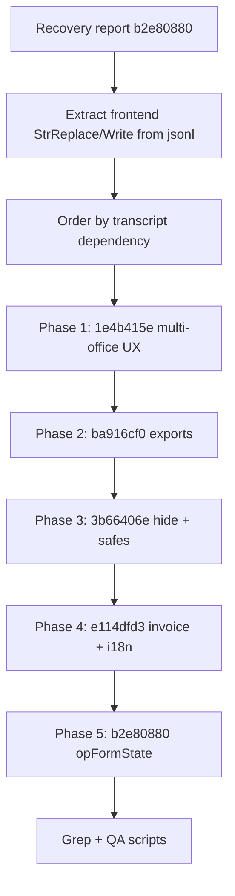

# Frontend Transcript Restoration Plan

**Authoritative source:** Frontend Restoration Report from [b2e80880-ca7f-4ff4-ba83-d3ff7a9848af](b2e80880-ca7f-4ff4-ba83-d3ff7a9848af) (request `e8e36178-7aad-41a8-9e04-16a02d4653a2`).

**Root cause:** Commit `08f4da2` restored backend only; frontend lived in uncommitted working-tree changes that were lost after `git reset` to `origin/main`. No git stash or committed snapshot exists for the full frontend.

**Current baseline (keep):** [frontend/travel-erp-api-bridge.js](frontend/travel-erp-api-bridge.js) (1,358 lines) and [frontend/travelsystemv3.html](frontend/travelsystemv3.html) (1,647 lines) already contain partial work: `AppShell`, office switcher, basic office CRUD, user **create**, server pagination for clients/vendors/operations/vouchers, API-backed dashboard/reports.

---

## Files to Restore

| File | Transcript source(s) | Restoration action |
|------|---------------------|-------------------|
| [frontend/travel-erp-api-bridge.js](frontend/travel-erp-api-bridge.js) | [1e4b415e](1e4b415e-9684-4d48-89f9-5afafa7907cb), [ba916cf0](ba916cf0-abd4-4ff9-8dd0-bf5d1c01981e), [3b66406e](3b66406e-375f-4e34-ade3-2a02c72f4711), [e114dfd3](e114dfd3-abac-4843-985a-ffcd448e4f39), [b2e80880](b2e80880-ca7f-4ff4-ba83-d3ff7a9848af) | Replay ~44 frontend `StrReplace` ops in dependency order; target ~2,500 lines |
| [frontend/travelsystemv3.html](frontend/travelsystemv3.html) | [1e4b415e](1e4b415e-9684-4d48-89f9-5afafa7907cb), [3b66406e](3b66406e-375f-4e34-ade3-2a02c72f4711) | Replay ~15 frontend `StrReplace` ops + restore modals/nav/CSS |
| [frontend/scripts/browser-export-qa.mjs](frontend/scripts/browser-export-qa.mjs) | [ba916cf0](ba916cf0-abd4-4ff9-8dd0-bf5d1c01981e) | Full `Write` restore |
| [frontend/scripts/browser-filter-pagination-qa.mjs](frontend/scripts/browser-filter-pagination-qa.mjs) | [1e4b415e](1e4b415e-9684-4d48-89f9-5afafa7907cb) | Full `Write` restore |
| [frontend/scripts/browser-hide-restore-qa.mjs](frontend/scripts/browser-hide-restore-qa.mjs) | [3b66406e](3b66406e-375f-4e34-ade3-2a02c72f4711) | Full `Write` restore |
| [frontend/scripts/browser-invoice-whatsapp-qa.mjs](frontend/scripts/browser-invoice-whatsapp-qa.mjs) | [e114dfd3](e114dfd3-abac-4843-985a-ffcd448e4f39) | Full `Write` restore |
| [frontend/scripts/browser-profile-settings-qa.mjs](frontend/scripts/browser-profile-settings-qa.mjs) | [1e4b415e](1e4b415e-9684-4d48-89f9-5afafa7907cb) | Full `Write` restore |
| [frontend/scripts/browser-safe-transfer-qa.mjs](frontend/scripts/browser-safe-transfer-qa.mjs) | [3b66406e](3b66406e-375f-4e34-ade3-2a02c72f4711) | Full `Write` restore |
| [frontend/scripts/browser-operation-create-qa.mjs](frontend/scripts/browser-operation-create-qa.mjs) | [b2e80880](b2e80880-ca7f-4ff4-ba83-d3ff7a9848af) | Full `Write` restore |
| [frontend/scripts/browser-multi-office-qa.mjs](frontend/scripts/browser-multi-office-qa.mjs) | [1e4b415e](1e4b415e-9684-4d48-89f9-5afafa7907cb) | Already present; verify unchanged vs transcript final version |

**Optional (not in user scope but referenced in transcripts):**
- [backend/scripts/live-multi-office-qa.sh](backend/scripts/live-multi-office-qa.sh) from [1e4b415e](1e4b415e-9684-4d48-89f9-5afafa7907cb) — API E2E shell script, not frontend UI; skip unless requested.

**Explicitly excluded (per rules):** All backend files, migrations, routes, APIs.

---

## Restoration Method



1. **Build a replay helper** (temporary script under `frontend/scripts/`) that parses the five primary transcript `.jsonl` files, extracts tool calls where `path` starts with `frontend/`, and applies `StrReplace`/`Write` in transcript chronological order.
2. **Skip backend-only edits** automatically (filter paths outside `frontend/`).
3. **Handle partial baseline:** When `old_string` does not match (already-applied or diverged chunk), skip if `new_string` content is already present; otherwise apply manually using the transcript's `new_string` as authoritative.
4. **Do not re-implement from scratch** — every addition must trace to a transcript tool call.
5. **Delete replay helper** after restoration completes (keep only QA scripts).

---

## Feature-by-Feature Restoration Map

### 1. Multi-office UI — [1e4b415e](1e4b415e-9684-4d48-89f9-5afafa7907cb) + [b2e80880](b2e80880-ca7f-4ff4-ba83-d3ff7a9848af)

| Missing piece | Transcript | Key symbols |
|---------------|-----------|-------------|
| Office branding in topbar/sidebar | 1e4b415e | `renderOfficeBranding()`, `#topbarOfficeLogo`, `#sidebarOfficeLogo`, `officeLogoUrl()` |
| Improved `enterApp()` office restore | 1e4b415e, b2e80880 | `current_office_id \|\| office_id \|\| office?.id` |
| Modal/drawer reset on office switch | 1e4b415e | `switchOffice()` closes modals, clears caches |
| Operation form hardening | b2e80880 | `opFormState`, guarded `populateOpForm()`, loading guard |

**Already present:** `OFFICES`, `currentOffice`, `X-Office-Id`, `#officeSwitcher`, `switchOffice()`.

### 2. Office management — [1e4b415e](1e4b415e-9684-4d48-89f9-5afafa7907cb)

| Missing piece | Key symbols |
|---------------|-------------|
| Edit office modal | `#editOfficeModal`, `openEditOffice()`, `saveOfficeEdit()` |
| Logo upload on create/edit | FormData in `apiFetch()`, `POST/DELETE /api/offices/{id}/logo` |
| Logo preview + delete | file inputs, preview img, `deleteOfficeLogo()` |

**Already present:** Settings card **فروع الوكالة**, `#newOfficeModal`, `saveOffice()`, `toggleOfficeActive()`.

### 3. User management — [1e4b415e](1e4b415e-9684-4d48-89f9-5afafa7907cb)

| Missing piece | Key symbols |
|---------------|-------------|
| Edit user modal | `#editUserModal`, `openEditUser()`, `saveUserEdit()` |
| Activate/deactivate | `toggleUserActive()` → `PATCH /api/users/{id}` |
| Reset password | `resetUserPassword()` → `PATCH /api/users/{id}/reset-password` |
| Row action buttons | تعديل / تفعيل / تعطيل / إعادة تعيين كلمة المرور |

**Already present:** `#newUserModal`, `saveUser()`, `populateUserForm()`, office column.

### 4. Password change UI — [1e4b415e](1e4b415e-9684-4d48-89f9-5afafa7907cb)

| Missing piece | Key symbols |
|---------------|-------------|
| Editable email + password section | `#prof_email`, `#prof_password_*`, show/hide toggles |
| Save handler | `saveProfilePassword()` → `PATCH /api/profile/password` |

### 5. Activity log UI — [1e4b415e](1e4b415e-9684-4d48-89f9-5afafa7907cb) + [e114dfd3](e114dfd3-abac-4843-985a-ffcd448e4f39)

| Missing piece | Key symbols |
|---------------|-------------|
| Sidebar nav **سجل النشاط** | `data-page="activity"`, `canViewPage` for admin/auditor |
| Full page renderer | `renderActivityLogs()`, `reloadActivityLogs()`, `paintActivityTable()` |
| Arabic labels | `activityActionLabel()`, `formatActivityDetails()` |
| Filters + pagination | `#actSearch`, `#actActionFilter`, `#actFrom`/`#actTo`, `serverPagerHtml` |

### 6. Invoice PDF + WhatsApp — [e114dfd3](e114dfd3-abac-4843-985a-ffcd448e4f39) + [ba916cf0](ba916cf0-abd4-4ff9-8dd0-bf5d1c01981e)

| Missing piece | Key symbols |
|---------------|-------------|
| Operation drawer buttons | **فاتورة PDF**, **طباعة فاتورة**, **واتساب** |
| Export handlers | `exportOperationInvoicePDF()`, `printOperationInvoicePDF()`, `sendWhatsAppInvoice()` |
| Signed link | `GET /api/operations/{id}/invoice-share` → `wa.me` builder |

### 7. Hidden clients/operations — [3b66406e](3b66406e-375f-4e34-ade3-2a02c72f4711)

| Missing piece | Key symbols |
|---------------|-------------|
| Row hide buttons | `hideClient()`, `hideOperation()` |
| Settings hidden sections | **العملاء المخفيون** / **العمليات المخفية**, `loadHiddenSettings()` |
| Restore actions | `restoreClient()`, `restoreOperation()` |
| Dropdown exclusion | hidden clients excluded from `populateOpForm()` |

### 8. Safe transfer UI — [3b66406e](3b66406e-375f-4e34-ade3-2a02c72f4711)

| Missing piece | Key symbols |
|---------------|-------------|
| Safes page tabs | **الصناديق والبنوك** \| **سجل التحويلات** |
| Modals | `#newSafeModal`, `#editSafeModal`, `#newTransferModal` |
| CRUD + transfer list | `reloadSafesPage()`, `saveSafe()`, `saveTransfer()` |

### 9. Backend export buttons — [ba916cf0](ba916cf0-abd4-4ff9-8dd0-bf5d1c01981e)

| Missing piece | Key symbols |
|---------------|-------------|
| Export infrastructure | `exportActionBar()`, `runBackendExport()`, `downloadBackendExport()` |
| Replace client-side exports | operations/clients/vendors/vouchers/journal/reports/activity |
| Statement/voucher print | `printClientStmtPDF()`, `printVoucherExport()` |

### 10. Filter/search + pagination — [1e4b415e](1e4b415e-9684-4d48-89f9-5afafa7907cb)

| Missing piece | Key symbols |
|---------------|-------------|
| Date filters | `#opFrom`/`#opTo`, `#dashFrom`/`#dashTo`, `#rptFrom`/`#rptTo`, `#stmtFrom`/`#stmtTo` |
| Journal server pagination | `reloadJournalList()`, `paintJournalTable()` |
| Unified filter bar | `.filter-bar`, `applyDateParams()`, `searchFilterBar()` |

**Already present:** Server search/pagination for clients, vendors, operations, vouchers.

### 11. Dashboard enhancements — [1e4b415e](1e4b415e-9684-4d48-89f9-5afafa7907cb)

| Missing piece | Key symbols |
|---------------|-------------|
| Date-range KPI filter | `filterDashboard()`, dynamic period labels |

### 12. Arabic API errors — [e114dfd3](e114dfd3-abac-4843-985a-ffcd448e4f39)

| Missing piece | Key symbols |
|---------------|-------------|
| Error translation layer | `translateApiMessage()` in `apiFetch` error handler |

---

## Pre-Apply Summary (shown to user before edits)

Before any file writes, print:

1. **File list** — all 10 files above with CREATE vs MODIFY status
2. **Transcript map** — which UUID contributed each file/section
3. **Gap summary** — 1 feature fully present, 8 partial, 6 fully missing (per recovery report)
4. **Estimated delta** — bridge grows from 1,358 → ~2,500 lines; HTML grows ~200–300 lines

---

## Execution Order (after plan approval)

1. Run replay script against transcripts in order: **1e4b415e → ba916cf0 → 3b66406e → e114dfd3 → b2e80880**
2. Manually resolve any failed `StrReplace` matches using transcript `new_string` blocks
3. Restore 6 QA scripts via transcript `Write` contents
4. Grep-verify all key symbols from recovery report exist
5. Run QA scripts against local server (`php artisan serve` + seeded DB)

---

## Remaining Unrecoverable Items (risk register)

| Item | Risk | Mitigation |
|------|------|------------|
| Exact byte-for-byte match to pre-rollback tree | Medium — no git snapshot | Transcript replay is best available source; verify via QA scripts |
| Transcript `[REDACTED]` chunks | Low — tool call payloads are preserved in jsonl | Use raw `StrReplace`/`Write` inputs, not assistant prose |
| Overlapping edits from 9eba387e / 6c5e0a9e | Low — already in current baseline | Skip ops whose `new_string` is already present |
| `live-multi-office-qa.sh` | N/A — backend script, out of scope | Skip unless user requests |

---

## Post-Completion Deliverables

- **Modified files list** — all frontend files touched
- **Restored features list** — mapped to 15 scope areas
- **Remaining gaps** — anything grep/QA fails to confirm
- **QA checklist** (below)

---

## QA Checklist

**Setup:** Backend running, DB seeded, `SEED_USER_PASSWORD` set, Playwright installed.

| # | Area | Verification |
|---|------|-------------|
| 1 | Multi-office | Login as `super@travel.kw`; switcher visible; switch office; data reloads; branding updates |
| 2 | Office mgmt | Create office; edit office; upload logo; logo appears in topbar/sidebar; delete logo |
| 3 | User mgmt | Create user; edit name/role/office; deactivate; reactivate; reset password |
| 4 | Password change | Settings → change password with validation; show/hide toggles work |
| 5 | Activity log | Nav visible for admin/auditor; search/filter/date range; pagination; Arabic action labels |
| 6 | Invoice PDF | Operation drawer → download PDF + print invoice |
| 7 | WhatsApp | Operation drawer → WhatsApp opens with signed invoice URL |
| 8 | Hidden records | Hide client/operation; visible in Settings hidden sections; restore works |
| 9 | Safe transfers | Create safe; edit safe; create transfer; transfer log tab with filters |
| 10 | Exports | Backend Excel/PDF on operations, clients, vendors, vouchers, journal, reports, activity |
| 11 | Filters | Date filters on operations, dashboard, reports, statements, journal |
| 12 | Pagination | Server pager with totals on all list pages including journal + activity |
| 13 | Dashboard | Date range filter reloads KPIs with period labels |
| 14 | Operation create | Create op after office switch — no stale client ID errors |
| 15 | Automated QA | Run all 7 `browser-*-qa.mjs` scripts; expect all PASS |

**Automated commands after restoration:**

```bash
cd backend && php artisan serve &
cd frontend && for s in scripts/browser-*-qa.mjs; do node "$s"; done
```
